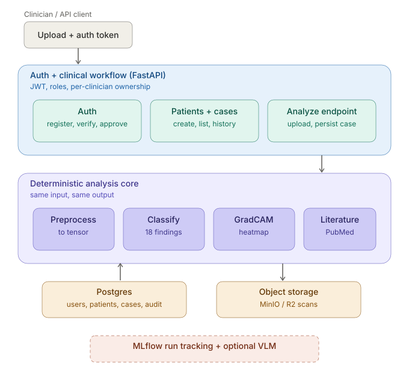
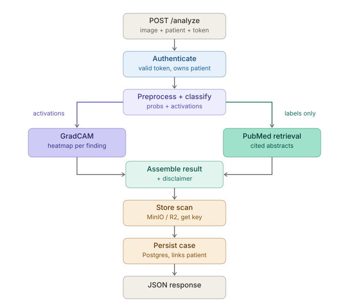

# Architecture

Design-time reference for MedVision AI. The polished portfolio version (with
final endpoint names and the resolved open picks) is a Phase 8 deliverable; this
is the map we build from.

## System in one line

Frontal chest X-ray in (DICOM or PNG/JPG) → calibrated multi-pathology
predictions + per-finding GradCAM overlay + cited PubMed literature out. One
API, containerized, non-diagnostic, clinician-in-the-loop.

## Phase boundaries

Phases 0–5 form a complete, demo-able stateless system. Phase 6 wraps that
core in a multi-user clinical workflow (admin + clinician, persisted cases, audit
trail; see D-08/D-09). Phase 7 (VLM narrative) is optional and sits outside the
deterministic core. Phase 8 is evaluation, model card, deployment, and portfolio
docs.

| Phase | Deliverable | Runs on |
|-------|-------------|---------|
| 0 | Scaffolding: repo, Docker, FastAPI skeleton, /health, tests, docs | local CPU |
| 1 | Data + preprocessing; unlabeled dev images + small labeled subset (measurement-only) | local CPU |
| 2 | Core inference: TorchXRayVision DenseNet, per-pathology probs, MLflow logging | local CPU |
| 3 | Explainability (GradCAM) + calibration | local CPU |
| 4 | Literature RAG via NCBI E-utilities (PubMed) | local CPU |
| 5 | API + demo UI + lightweight per-pathology eval — stateless demo complete | local CPU |
| 6 | Multi-user clinical workflow: admin/clinician roles, auth, persisted cases (MinIO/R2 scan storage), audit trail | local CPU |
| 7 | Optional VLM narrative (LLaVA-Med / CheXagent), constrained by core output | Colab/Kaggle GPU |
| 8 | Full eval, model card, deployment, portfolio write-up | mixed |

## Tool inventory

Backend core (local CPU)
- FastAPI — API layer; the API is the product.
- Uvicorn — ASGI server.
- Docker / docker-compose — reproducible environment (D-01).
- Python 3.11 — pinned interpreter (D-02).

Imaging & inference (local CPU)
- TorchXRayVision — pretrained DenseNet; emits the multi-pathology taxonomy we
  inherit (we build around it, we don't train it).
- torch / torchvision — model runtime.
- MONAI — medical-imaging transforms; used thinly, domain-appropriate signal.
- pydicom — reads DICOM (D-06).
- Pillow / numpy — PNG/JPG decode and array handling.

Explainability & calibration (local CPU)
- GradCAM — per-finding heatmap overlay; hooks the classifier's final conv layer.
- scikit-learn — ROC/AUC and operating-point metrics (measurement only, D-07).

Literature grounding (local CPU)
- NCBI E-utilities (esearch/efetch) — PubMed abstracts per detected finding.
- Vector store (Chroma or FAISS — open pick) + embedding model — similarity
  search over abstracts for grounded, cited retrieval.

Experiment tracking (local CPU)
- MLflow — logs model version, thresholds, timestamp per inference run.

Optional narrative (Colab/Kaggle GPU — Phase 7, outside the core)
- LLaVA-Med / CheXagent — VLM narrative, constrained by deterministic
  predictions + citations (D-04).

Demo UI (Phase 5)
- Gradio-in-FastAPI or Next.js (open pick).

## Architecture (structural view)

The auth and clinical-workflow layer wraps the deterministic analysis
core, backed by Postgres and object storage.

A chest X-ray enters the API. Inside the containerized, deterministic core
(FastAPI, local CPU): preprocessing normalizes it to a tensor; the
TorchXRayVision classifier produces per-pathology probabilities; explainability,
literature retrieval, and calibration operate on those outputs; MLflow logs each
run. The response is structured JSON with a non-diagnostic disclaimer. The
optional VLM layer sits outside this box — it consumes the JSON but never
feeds back into it.

## Request flow (one upload)

1. POST /analyze — upload one image.
2. Validate + decode (format, size).
3. Preprocess — normalize to a common tensor.
4. Classify — per-pathology probabilities and retained activations.
5. Apply thresholds — flag present findings (published operating points, D-07).
6. Fan out, in parallel:
   - GradCAM consumes the flagged findings + the classifier's activations
     + the image tensor → heatmap per finding. (Tight coupling: reaches back into
     the model's forward pass.)
   - PubMed retrieval consumes the flagged finding labels only (strings)
     → cited abstracts. (Loose coupling: never touches the image or the model.)
7. Assemble + log — structured JSON, MLflow run metadata, disclaimer.

The two branches are parallel because neither is an input to the other, not
because they share an input — they consume different upstream artifacts and
rejoin only at assembly.
